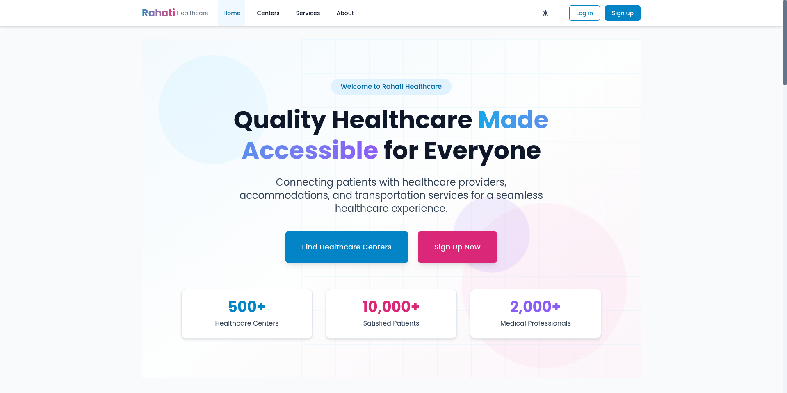
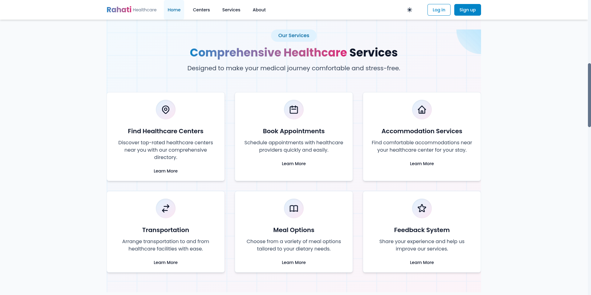
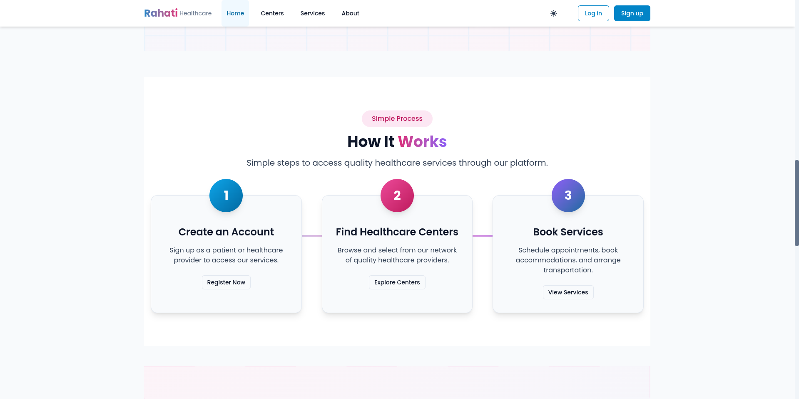
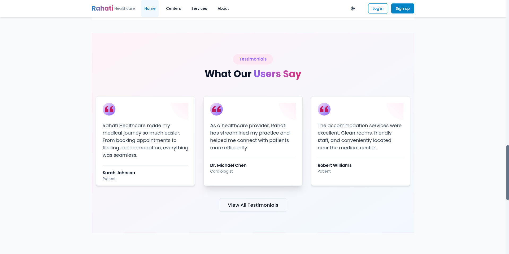

# Rahati Healthcare Platform

## Overview
Rahati is a comprehensive healthcare management platform designed to streamline patient care, provider coordination, and administrative operations. With an intuitive interface and robust features, Rahati empowers healthcare centers, providers, and patients to connect and collaborate efficiently.

---

## Key Features
- **User Management:** Secure authentication, role-based access (Admin, Provider, Patient, Superuser)
- **Appointment Scheduling:** Book, manage, and track appointments with ease
- **Consultations:** Manage medical consultations, notes, and follow-ups
- **Accommodations:** Book and manage patient rooms and meal options
- **Transportation:** Request and manage patient transportation
- **Payments:** Process and track payments securely
- **Feedback & Notifications:** Collect patient feedback and send real-time notifications

---

## Getting Started
### Installation
1. **Clone the repository:**
   ```bash
   git clone https://github.com/username/rahati.git
   cd rahati
   ```
2. **Install dependencies:**
   ```bash
   cd rahati-frontend
   npm install
   ```
3. **Start the development server:**
   ```bash
   npm run dev
   ```
   The app will be available at `http://localhost:5173` by default.

---

## Landing Page Visual Walkthrough
The following images correspond to the main sections (0 to 4) of the Rahati landing page. Each section is designed to engage users and highlight the platform's strengths.

### Section 0: Welcome & Introduction

*Start your journey with Rahati. A welcoming introduction to the platform's mission and vision.*

### Section 1: Key Features Overview

*Discover the core features that make Rahati a powerful healthcare management solution.*

### Section 2: Seamless Appointments

*Effortlessly schedule and manage appointments with a user-friendly interface.*


### Section 3: Feedback & Real-Time Updates

*Stay informed with notifications and provide feedback to continuously improve the experience.*

---

## API Overview
Rahati provides a RESTful API for all core operations. Authentication is handled via Bearer tokens. Here are some key endpoints:

### Authentication
- `POST /auth/login` — User login
- `POST /auth/register` — Register a new user
- `POST /auth/logout` — Logout
- `GET /auth/user` — Get current user details

### Users
- `GET /users` — List users (Admin only)
- `GET /users/{user_id}` — Get user profile
- `POST /users` — Create user (Admin only)
- `PUT /users/{user_id}` — Update user
- `DELETE /users/{user_id}` — Delete user (Admin only)

### Appointments
- `GET /appointments` — List appointments
- `POST /appointments` — Create appointment
- `PUT /appointments/{id}` — Update appointment
- `DELETE /appointments/{id}` — Cancel appointment

### Consultations
- `GET /consultations` — List consultations
- `POST /consultations` — Start consultation
- `PUT /consultations/{id}` — Complete consultation
- `DELETE /consultations/{id}` — Cancel consultation

### Accommodations, Rooms, Meal Options, Transportation, Payments, Feedback, Notifications, Service Capacity
- Full CRUD endpoints for each resource (see `doc/api.json` for details)

